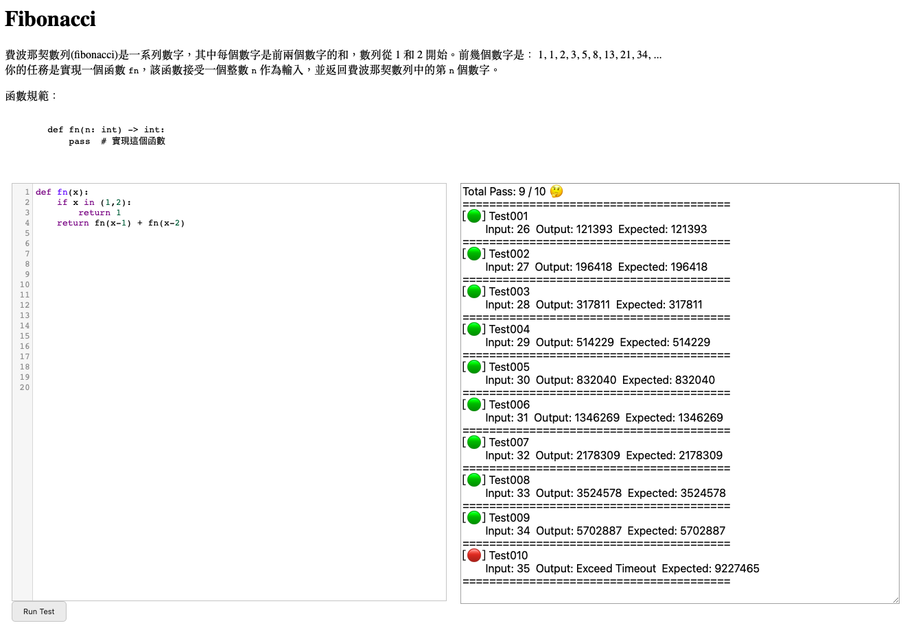

# Code Competition
This repo applies `faks-socketio`, `websocket`, and `jupyter notebook` to fulfill an interface that allow you to host a simple code competition.




## create vm (optional)

```bash
conda create -n {YOUR_VM_NAME} python=3.9
conda activate {YOUR_VM_NAME}
```

## install package and dependency
```bash
pip install -r requirements.txt
```

## start jupyter notebook
```bash
jupyter notebook
```

## start flask-socketio server
```bash
python app.py
```


## TODO
- [x] (snippet) jupyter notebook api
- [x] (socketio) connect and disconnect
- [x] (flask) template index.html
- [x] (flask) beautify code block by codemirror 
- [x] (jupyter) notebook crud
- [x] (jupyter) session and kernel lifecycle
- [x] (websocket) send message onto jupyter kernel
- [x] (websocket) parse recieve message from kernel
- [x] (socketio) main message process
- [x] (socketio) use cookie for cache
- [x] (algorithm) fibonacci as the code case
- [ ] (jupyter) force stopping kernel while timeout
- [ ] (socketio) async emit the message
- [ ] (websocket) unstable process order

---
